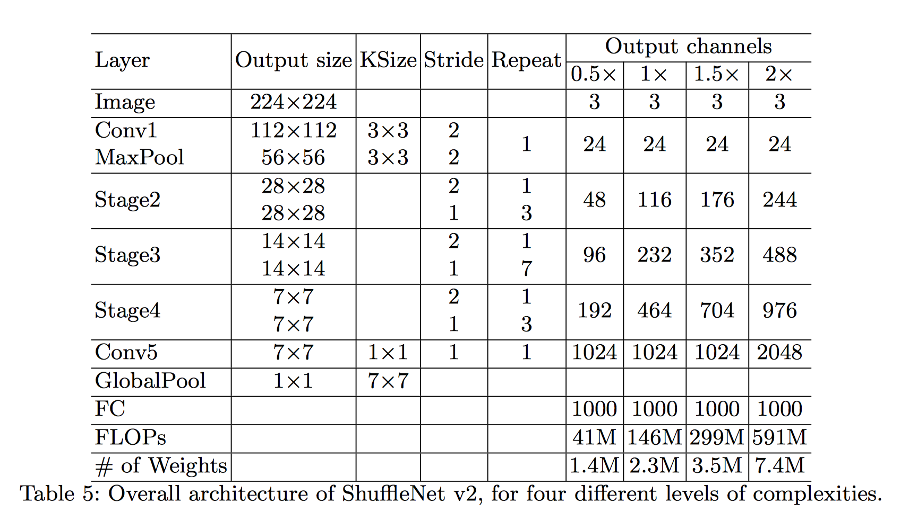

# ShuffleNetV2.Caffe2
## How to Use


```python
from caffe2.python import cnn
from shufflenetv2 import add_ShuffleNet_V2

cnn_model = cnn.CNNModelHelper()

add_ShuffleNet_V2(cnn_model, output_channels=[24, 48, 96, 192, 1024],
                      stride_1_repeat_times=[3, 7, 3],
                      stride_2_repeat_times=[1, 1, 1],     # Set according to the Table
                      testing=False,                       # For training
                      detection=False)                     # Build net as backbone of a two-stage detection model
                      
workspace.RunNetOnce(cnn_model.param_init_net)

workspace.FeedBlob("data", np.random.randn(8, 3, 224, 224).astype(np.float32))
workspace.RunNetOnce(cnn_model.Proto())

print(workspace.FetchBlob('conv_5'))
```
### Use ShuffleNet on Detectron
If you want tu use ShuffleNetV2 as a backbone of a detection framework (egg., Faster R-CNN, FPN), simply download [this file](https://github.com/wolegechu/Detectron/blob/master/detectron/modeling/ShuffleNetV2.py) to `detectron\modeling\ShuffleNetV2.py`, and set the parameter `CONV_BODY: ShuffleNetV2.add_ShuffleNet_V2` in the yaml file.
